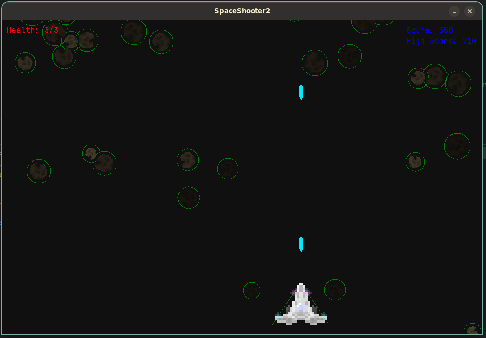
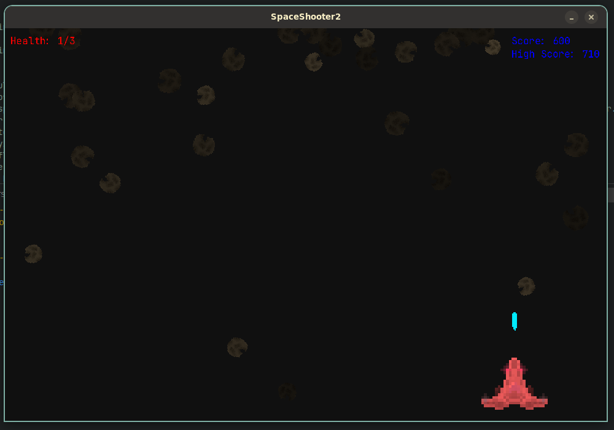
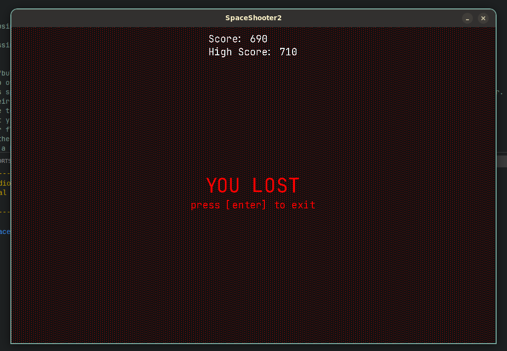

# project info
A school project in which I needed to create a space shooter utilising C# and MonoGame. This project contains a "Core" assembly, where a lot of the behind the scenes game logic comes into play. Think about game objects and calling methods such as Draw() and Update() on these game objects (if implemented). The other assembly is more focussed around the Gameplay logic and data. In this project I used two of my libraries: [BinarySerializer](https://github.com/thepigeongenerator/BinarySerializer) and [PixelControlLayer](https://github.com/thepigeongenerator/PixelControlLayer). Alongside the [MonoGame framework](https://monogame.net/).

## features
### keybinds
- You can move the spaceship around using `A` and `D`, or `<-` and `->`.
- View hitboxes when pressing `F3`[^hitboxes]
- Instantly kill the player when pressing `F12`

### gameplay
- The spaceship continuously shoots "bullets" to destroy the asteroids.
- Asteroids are spawned in at the top of the screen with a random rotation size, and X position. Smaller asteroids are lighter than larger ones.
- Sometimes an unbreakable astroid is spawned in; these ones are spawned directly above the player and as the name suggests; can't be destroyed by the player. Their asteroid texture is darkened regardless of their size to visualize this.
- The player's health is shown in the top left of the screen, the score and highscore is shown in the top right.
- Each asteroid destroyed by a bullet yields 10 "score".
- If an asteroid hits you, the player flashes red, and 1 health is subtracted.[^damage]
- If the player's health reaches 0, the lose screen will be shown.[^lose]
- The highscore is stored locally in a binary file when the game exits.
- The spaceship's texture has a subtle animation where the lights "blink"[^texture]

[^hitboxes]: here is an example of hitboxes being shown: 
[^damage]: here is an example of the spaceship flashing red when being damaged: 
[^lose]: here is an example of the lose screen: 
[^texture]: [view the texture files here](./SpaceShooter2/Content/spaceship/)
