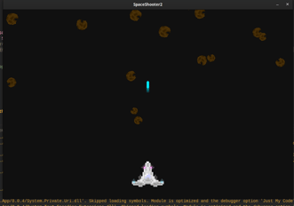

## project info
I was unsatisfied with the [original version](https://github.com/thepigeongenerator/SpaceShooter) which I go more into detail in that repo. But, this project is a redesign of that one, where I attempt to use a more functional design in the code.

### features
- You can move the spaceship around using `a` and `d`.
- The spaceship's [texture](./SpaceShooter2/Content/spaceship/) has a subtle animation where the lights "blink"
- The spaceship continuiously shoots "bullets" to destroy the astroids.
- Astroids are spawned in at the top of the screen with a random rotation and X position.
- Sometimes an unbreakable astroid is spawned in; these ones are spawned directly above the player and as the name suggests; can't be destroyed by the player. Their astroid texture is darkened to visualize this.
